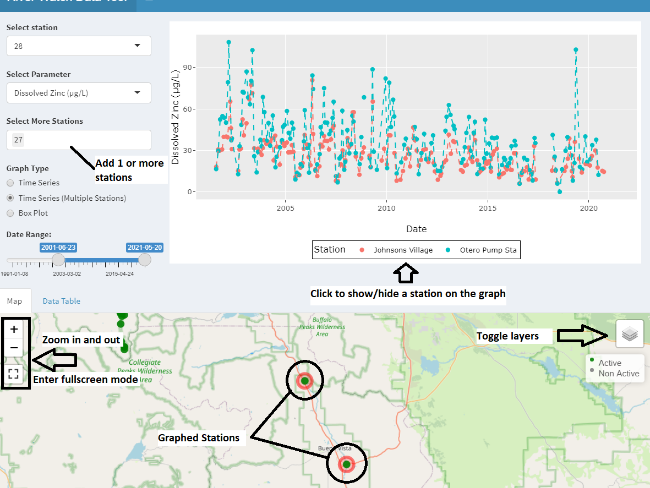

      
  
# Colorado River Watch Data Tool - User Guide
Noah Goodkind, Colorado Parks and Wildlife  
April 2022 
## Introduction 

 
[River Watch](https://coloradoriverwatch.org/) is a statewide volunteer water quality-monitoring program operated in partnership between [River Science](https://www.river.science/) and [Colorado Parks and Wildlife (CPW)](https://cpw.state.co.us/). Our mission is to work with voluntary stewards to monitor water quality and utilize this data to educate communities and help inform decision makers about the condition of Colorado’s waters.      
  
The River Watch Data Tool was created to provide an interactive way to visualize River Watch data across the state. 

### 
 Data 
  
All of the data used in this application can be found in the [River Watch Database]( https://www.coloradoriverwatch.com/#!/home). The application will be updated annually with new data. River Watch data is also available through the [National Water Quality Portal]( https://www.waterqualitydata.us/) or the [Colorado Data Sharing Network]( http://www.coloradowaterdata.org/). Learn more about River Watch methods [here]( https://coloradoriverwatch.org/our-data/).  
## 
Using the Tool 
 
There are two main tabs in the tool, “By Station” and “By River or WBID.” Each tab allows the user to explore River Watch data differently. These are described in more detail below.   
### 
By Station 
 
**_Inputs and Graphs:_**  
  
Use this tab to explore River Watch data by station.  
Begin by selecting a station from the “Select Station” dropdown menu or by clicking a station on the map.  
* The “Select Parameter” dropdown menu allows you to select the desired parameter. This includes field parameters (pH, temperature, dissolved oxygen, hardness and alkalinity), total and dissolved metal results, and nutrient results.  
* The “Graph Type” buttons control the type of graph that is displayed.  
* The “Time Series” button will graph a time series scatter plot with lines.  
* The “Box Plot” button will graph a box and whisker plot for the selected station for each month.  
* More than one station can be graphed using the “Time Series (Multiple Stations)” button. Users can manually enter additional stations here.  
* Filter the data by using the “Date Range:” slider.  
  
The graphs that are produced are interactive. Users can hover their mouse over a point to see the exact value or click and drag to zoom in on an area of interest. Use the control panel, along the upper right portion of the graph, to download a picture of the graph or toggle additional graph controls. If there is a legend, click on an object in the legend to hide that feature. Double click to isolate the feature and hide the other features.  
  
**_Map and Data Table:_**  
  
To access the map, click on the map tab. The map defaults to active stations across the state. Use the layer control panel to add non active stations, enable satellite view, or display the major river basins in the state by clicking on the layer icon in the upper right corner of the map (see toggle layer arrow below). Navigate the map using the mouse wheel or zoom controls in the upper left corner. Hover over a station to preview site information. Click a station to see additional site information. Stations that are being graphed are outlined in red on the map.   
   
To access the data table, click on the data table tab. This table shows the data being used in the displayed graph. It is controlled via the “Select Station” dropdown and the “Date Range” slider. You can copy the data with the copy button or use the download button to download the data as a CSV or an excel file.  
  

### 
By River or WBID 
 
**_Inputs and Graphs:_**  
  
Use this tab to explore data for stations that share either a river or Water Body ID. Water body identification (WBID) is an assessment unit used by the Colorado Department of Public Health and the Environment to represent Colorado's waterbodies at the watershed or sub-watershed scale.  
* Use the “Select Watershed” input to choose a watershed.  
* The “Graph By” buttons filter stations located in the selected watershed based on a River or WBID.  
* The "Parameter” dropdown menu allows you to select the desired parameter. This includes field parameters (pH, temperature, dissolved oxygen, hardness and alkalinity), total and dissolved metal results, and nutrient results.  
* The “Date Range” slider allows you to filter the dates shown.  
  
The resulting time series scatter plot shows the selected parameter over time. Different stations are distinguished by color.    
Click the “Trendline” checkbox to enable or disable a trendline. Be careful drawing conclusions from the trendline. Consider station location, how much data is available, and the time period covered (see the trendline section below).  
  
**_Map and Data Table:_**  
  
When the “River or WBID” tab is first clicked, the map will show up with the major basins outlined. Stations will appear on the map once inputs are selected. Hover or click on a station for additional station information.  
  
To access the data table, click on the data table tab. The data in the table is the same data that is being used for the graph. Again, there are download and copy buttons available to explore the data further.  
### 
Aquatic Life Standards 
 
Certain parameters reveal a "Calculate Aquatic Life Standards" checkbox. Click this to add standards to the graph. In this tool, standards are shown for total aluminum, dissolved arsenic, dissolved cadmium (Acute not shown), dissolved copper, total iron, dissolved lead, dissolved manganese, dissolved zinc, and pH. Many of these standards are hardness based, meaning the standard changes as total hardness changes. The titrated total hardness measurements are used to calculate the hardness based standards.  
  
Standards are not included for all parameters and are provided for reference only. River Watch focuses on gathering high quality data for any community member, agency or entity to use in their own decision processes. **River Watch does not assign attainment or impairment of aquatic life standards**. For more information on Colorado surface water quality classifications and standards, visit the [Water Quality Control Commission’s regulation list](https://cdphe.colorado.gov/water-quality-control-commission-regulations).  

### 
 Trendline 
 
The trendline can be used as a tool to visualize potential patterns in the data. However, use caution drawing conclusions about an entire river or watershed’s health based on the trendline. There are varying degrees of spatial and temporal coverage depending on what inputs are selected, all of which influence the shape of the trendline.  
  
The trendline uses a smoothed conditional mean equation to smooth fluctuations in the data and try to display patterns more clearly. It is produced using the ggplot2 function, `geom_smooth()`. Documentation for the function can be found [here]( https://ggplot2.tidyverse.org/reference/geom_smooth.html).  

